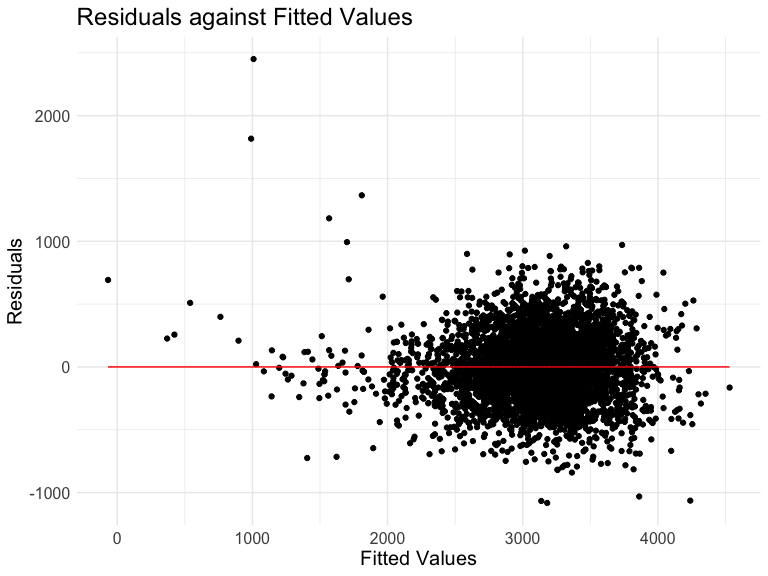
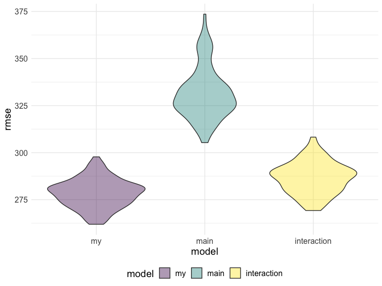
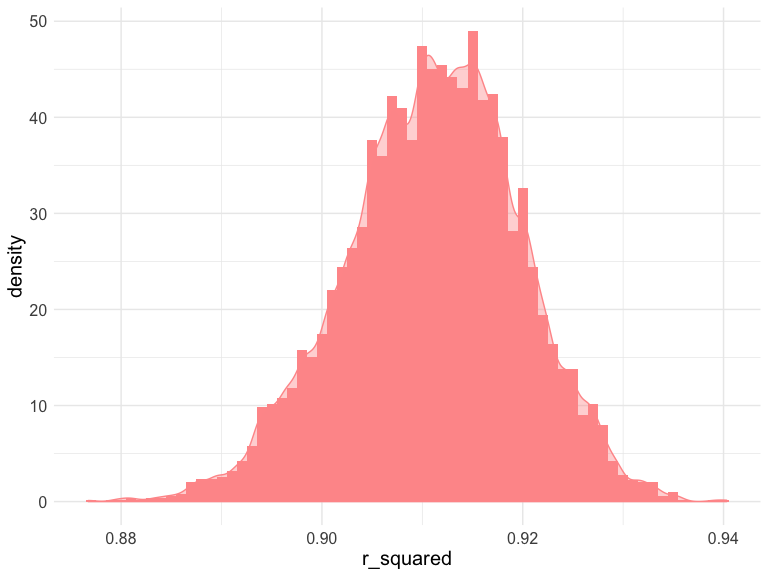
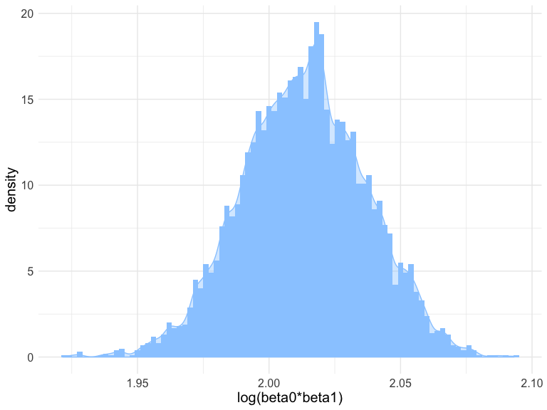

p8105\_hw6\_wx2233
================
Weijia Xiong
11/15/2019

## Problem 1

### Load and clean the data

``` r
birthweight = 
  read.csv("./data/birthweight.csv") %>% 
  janitor::clean_names() %>% 
  drop_na() %>% 
  mutate(
    babysex = recode(babysex,"1" = "male",  "2" = "female") %>% 
      as.factor(),
    frace = recode(frace, "1" = "White", "2" = "Black", "3" = "Asian", "4" = "Puerto Rican", "8" = "Other","9" = "Unknown") %>% 
      as.factor(),
    malform = recode(malform, "0" = "absent", "1" = "present") %>% 
      as.factor(),
    mrace = recode(mrace, "1" = "White", "2" = "Black", "3" = "Asian", "4" = "Puerto Rican", "8" = "Other") %>% 
      as.factor()
  )
```

### Propose a regression model

Initial
model:

``` r
fit1  = lm(bwt ~ babysex + bhead + blength + delwt + fincome + frace + gaweeks + menarche + momage + mheight + mrace + parity + pnumlbw + pnumsga + ppbmi + ppwt + smoken + wtgain, data = birthweight)
summary(fit1)
```

    ## 
    ## Call:
    ## lm(formula = bwt ~ babysex + bhead + blength + delwt + fincome + 
    ##     frace + gaweeks + menarche + momage + mheight + mrace + parity + 
    ##     pnumlbw + pnumsga + ppbmi + ppwt + smoken + wtgain, data = birthweight)
    ## 
    ## Residuals:
    ##      Min       1Q   Median       3Q      Max 
    ## -1097.66  -184.94    -3.24   173.08  2343.95 
    ## 
    ## Coefficients: (3 not defined because of singularities)
    ##                     Estimate Std. Error t value Pr(>|t|)    
    ## (Intercept)       -6305.8665   659.1520  -9.567  < 2e-16 ***
    ## babysexmale         -28.6899     8.4633  -3.390 0.000705 ***
    ## bhead               130.7818     3.4518  37.888  < 2e-16 ***
    ## blength              74.9491     2.0212  37.082  < 2e-16 ***
    ## delwt                 4.1026     0.3946  10.398  < 2e-16 ***
    ## fincome               0.2893     0.1795   1.612 0.107079    
    ## fraceBlack           -6.8928    78.8259  -0.087 0.930324    
    ## fraceOther          -16.9587    97.5820  -0.174 0.862039    
    ## fracePuerto Rican   -68.2191    78.4603  -0.869 0.384637    
    ## fraceWhite          -21.1932    69.2874  -0.306 0.759716    
    ## gaweeks              11.5473     1.4651   7.881 4.07e-15 ***
    ## menarche             -3.5553     2.8946  -1.228 0.219407    
    ## momage                0.7629     1.2217   0.624 0.532390    
    ## mheight               9.7740    10.3099   0.948 0.343172    
    ## mraceBlack          -60.0256    80.9438  -0.742 0.458387    
    ## mracePuerto Rican    34.9011    80.9389   0.431 0.666342    
    ## mraceWhite           91.4092    71.9106   1.271 0.203744    
    ## parity               95.5166    40.4743   2.360 0.018322 *  
    ## pnumlbw                   NA         NA      NA       NA    
    ## pnumsga                   NA         NA      NA       NA    
    ## ppbmi                 4.3385    14.8892   0.291 0.770769    
    ## ppwt                 -3.4707     2.6118  -1.329 0.183972    
    ## smoken               -4.8524     0.5868  -8.269  < 2e-16 ***
    ## wtgain                    NA         NA      NA       NA    
    ## ---
    ## Signif. codes:  0 '***' 0.001 '**' 0.01 '*' 0.05 '.' 0.1 ' ' 1
    ## 
    ## Residual standard error: 272.4 on 4321 degrees of freedom
    ## Multiple R-squared:  0.7183, Adjusted R-squared:  0.717 
    ## F-statistic:   551 on 20 and 4321 DF,  p-value: < 2.2e-16

First I built a model using lots of factors, then I remove some
inappropriate factors(collinearity or not significant) and add
interactions to rebuild the model.

Rebuilt the
model:

``` r
fit2  = lm(bwt ~ babysex * bhead * blength + delwt + gaweeks + ppbmi + smoken, data = birthweight)
summary(fit2)
```

    ## 
    ## Call:
    ## lm(formula = bwt ~ babysex * bhead * blength + delwt + gaweeks + 
    ##     ppbmi + smoken, data = birthweight)
    ## 
    ## Residuals:
    ##      Min       1Q   Median       3Q      Max 
    ## -1082.47  -181.77    -7.18   175.93  2450.58 
    ## 
    ## Coefficients:
    ##                             Estimate Std. Error t value Pr(>|t|)    
    ## (Intercept)                -758.5058  1074.0054  -0.706 0.480077    
    ## babysexmale               -5748.7004  1631.6486  -3.523 0.000431 ***
    ## bhead                       -28.6137    33.2872  -0.860 0.390057    
    ## blength                     -29.9927    22.8082  -1.315 0.188581    
    ## delwt                         3.5552     0.2877  12.356  < 2e-16 ***
    ## gaweeks                      14.0906     1.5009   9.388  < 2e-16 ***
    ## ppbmi                       -14.1838     1.9460  -7.289 3.70e-13 ***
    ## smoken                       -2.2939     0.5783  -3.967 7.40e-05 ***
    ## babysexmale:bhead           178.4769    49.6864   3.592 0.000332 ***
    ## babysexmale:blength         110.8532    34.1469   3.246 0.001178 ** 
    ## bhead:blength                 3.3319     0.6950   4.794 1.69e-06 ***
    ## babysexmale:bhead:blength    -3.4618     1.0274  -3.369 0.000760 ***
    ## ---
    ## Signif. codes:  0 '***' 0.001 '**' 0.01 '*' 0.05 '.' 0.1 ' ' 1
    ## 
    ## Residual standard error: 279.5 on 4330 degrees of freedom
    ## Multiple R-squared:  0.703,  Adjusted R-squared:  0.7022 
    ## F-statistic: 931.6 on 11 and 4330 DF,  p-value: < 2.2e-16

``` r
fit2 %>% 
  broom::tidy() %>% 
  knitr::kable()
```

| term                      |      estimate |    std.error |   statistic |   p.value |
| :------------------------ | ------------: | -----------: | ----------: | --------: |
| (Intercept)               |  \-758.505770 | 1074.0053847 | \-0.7062402 | 0.4800768 |
| babysexmale               | \-5748.700371 | 1631.6486459 | \-3.5232465 | 0.0004307 |
| bhead                     |   \-28.613736 |   33.2872443 | \-0.8596006 | 0.3900568 |
| blength                   |   \-29.992732 |   22.8082345 | \-1.3149958 | 0.1885810 |
| delwt                     |      3.555242 |    0.2877423 |  12.3556452 | 0.0000000 |
| gaweeks                   |     14.090601 |    1.5009465 |   9.3878103 | 0.0000000 |
| ppbmi                     |   \-14.183831 |    1.9459612 | \-7.2888563 | 0.0000000 |
| smoken                    |    \-2.293942 |    0.5782604 | \-3.9669708 | 0.0000740 |
| babysexmale:bhead         |    178.476870 |   49.6863803 |   3.5920683 | 0.0003317 |
| babysexmale:blength       |    110.853206 |   34.1469091 |   3.2463614 | 0.0011778 |
| bhead:blength             |      3.331889 |    0.6949606 |   4.7943562 | 0.0000017 |
| babysexmale:bhead:blength |    \-3.461790 |    1.0274249 | \-3.3693851 | 0.0007599 |

### Plot of residuals against fitted values

``` r
birthweight %>% 
  add_residuals(fit2) %>% 
  add_predictions(fit2) %>% 
  ggplot(aes(x = pred, y = resid)) +
  geom_point() +
  labs(
    x = "Fitted Values",
    y = "Residuals",
    title = "Residuals against Fitted Values"
  ) +
  geom_line( y = 0, color = "red")
```


The Residuals bounce around 0. But the variances of residuals are not
constant.

### Compare your model to two others:

``` r
fit3  = lm(bwt ~ blength + gaweeks, data = birthweight)
summary(fit3)
```

    ## 
    ## Call:
    ## lm(formula = bwt ~ blength + gaweeks, data = birthweight)
    ## 
    ## Residuals:
    ##     Min      1Q  Median      3Q     Max 
    ## -1709.6  -215.4   -11.4   208.2  4188.8 
    ## 
    ## Coefficients:
    ##              Estimate Std. Error t value Pr(>|t|)    
    ## (Intercept) -4347.667     97.958  -44.38   <2e-16 ***
    ## blength       128.556      1.990   64.60   <2e-16 ***
    ## gaweeks        27.047      1.718   15.74   <2e-16 ***
    ## ---
    ## Signif. codes:  0 '***' 0.001 '**' 0.01 '*' 0.05 '.' 0.1 ' ' 1
    ## 
    ## Residual standard error: 333.2 on 4339 degrees of freedom
    ## Multiple R-squared:  0.5769, Adjusted R-squared:  0.5767 
    ## F-statistic:  2958 on 2 and 4339 DF,  p-value: < 2.2e-16

``` r
fit3 %>% 
  broom::tidy() %>% 
  knitr::kable()
```

| term        |     estimate | std.error |  statistic | p.value |
| :---------- | -----------: | --------: | ---------: | ------: |
| (Intercept) | \-4347.66707 | 97.958360 | \-44.38281 |       0 |
| blength     |    128.55569 |  1.989891 |   64.60439 |       0 |
| gaweeks     |     27.04673 |  1.717930 |   15.74379 |       0 |

``` r
fit4  = lm(bwt ~ babysex * bhead * blength, data = birthweight)
summary(fit4)
```

    ## 
    ## Call:
    ## lm(formula = bwt ~ babysex * bhead * blength, data = birthweight)
    ## 
    ## Residuals:
    ##      Min       1Q   Median       3Q      Max 
    ## -1132.99  -190.42   -10.33   178.63  2617.96 
    ## 
    ## Coefficients:
    ##                             Estimate Std. Error t value Pr(>|t|)    
    ## (Intercept)                -801.9487  1102.3077  -0.728 0.466948    
    ## babysexmale               -6374.8684  1677.7669  -3.800 0.000147 ***
    ## bhead                       -16.5975    34.0916  -0.487 0.626388    
    ## blength                     -21.6460    23.3720  -0.926 0.354421    
    ## babysexmale:bhead           198.3932    51.0917   3.883 0.000105 ***
    ## babysexmale:blength         123.7729    35.1185   3.524 0.000429 ***
    ## bhead:blength                 3.3244     0.7126   4.666 3.17e-06 ***
    ## babysexmale:bhead:blength    -3.8781     1.0566  -3.670 0.000245 ***
    ## ---
    ## Signif. codes:  0 '***' 0.001 '**' 0.01 '*' 0.05 '.' 0.1 ' ' 1
    ## 
    ## Residual standard error: 287.7 on 4334 degrees of freedom
    ## Multiple R-squared:  0.6849, Adjusted R-squared:  0.6844 
    ## F-statistic:  1346 on 7 and 4334 DF,  p-value: < 2.2e-16

``` r
fit4 %>% 
  broom::tidy() %>% 
  knitr::kable()
```

| term                      |      estimate |    std.error |   statistic |   p.value |
| :------------------------ | ------------: | -----------: | ----------: | --------: |
| (Intercept)               |  \-801.948671 | 1102.3077046 | \-0.7275180 | 0.4669480 |
| babysexmale               | \-6374.868351 | 1677.7669213 | \-3.7996150 | 0.0001469 |
| bhead                     |   \-16.597546 |   34.0916082 | \-0.4868514 | 0.6263883 |
| blength                   |   \-21.645964 |   23.3720477 | \-0.9261475 | 0.3544209 |
| babysexmale:bhead         |    198.393181 |   51.0916850 |   3.8830816 | 0.0001047 |
| babysexmale:blength       |    123.772887 |   35.1185360 |   3.5244319 | 0.0004288 |
| bhead:blength             |      3.324444 |    0.7125586 |   4.6655020 | 0.0000032 |
| babysexmale:bhead:blength |    \-3.878053 |    1.0566296 | \-3.6702106 | 0.0002453 |

### Cross - Validation

``` r
cv_df =
  crossv_mc(birthweight, 100) %>% 
  mutate(
    train = map(train, as_tibble),
    test = map(test, as_tibble))

cv_df = 
  cv_df %>% 
  mutate(my_mod = map(train, ~fit2),
         main_mod = map(train, ~fit3),
         interaction_mod = map(train, ~fit4)) %>% 
  mutate(rmse_my = map2_dbl(my_mod, test, ~rmse(model = .x, data = .y)),
         rmse_main    = map2_dbl(main_mod, test, ~rmse(model = .x, data = .y)),
         rmse_interaction = map2_dbl(interaction_mod, test, ~rmse(model = .x, data = .y))
         )

cv_df %>% 
  select(starts_with("rmse")) %>% 
pivot_longer(
    everything(),
    names_to = "model", 
    values_to = "rmse",
    names_prefix = "rmse_") %>% 
  mutate(model = fct_inorder(model)) %>% 
  ggplot(aes(x = model, y = rmse)) + 
  geom_violin(aes(fill = model), alpha = .4)
```



From the plot we could see that the rmse of main model is the highest.
And my model’s rmse is lowest. It might indicates that my model fits
better.

## Problem 2

``` r
weather_df = 
  rnoaa::meteo_pull_monitors(
    c("USW00094728"),
    var = c("PRCP", "TMIN", "TMAX"), 
    date_min = "2017-01-01",
    date_max = "2017-12-31") %>%
  mutate(
    name = recode(id, USW00094728 = "CentralPark_NY"),
    tmin = tmin / 10,
    tmax = tmax / 10) %>%
  select(name, id, everything())
```

    ## Registered S3 method overwritten by 'crul':
    ##   method                 from
    ##   as.character.form_file httr

    ## Registered S3 method overwritten by 'hoardr':
    ##   method           from
    ##   print.cache_info httr

    ## file path:          /Users/osukuma/Library/Caches/rnoaa/ghcnd/USW00094728.dly

    ## file last updated:  2019-09-03 10:46:14

    ## file min/max dates: 1869-01-01 / 2019-08-31

### Bootstrap

``` r
estimate_fun = function(mod){
  mod_results =
    mod %>% 
    broom::tidy()
  tibble(
    r_squared = pull(mod %>% broom::glance(),adj.r.squared),
    log_result = log(pull(mod_results,estimate)[1] * pull(mod_results,estimate)[2]),
  )
}

weather_results = 
 weather_df %>% 
  modelr::bootstrap(n = 5000) %>% 
  mutate(
    models = map(strap, ~ lm(tmax ~ tmin, data = .x)),
    results = map(models, estimate_fun)) %>% 
  unnest(results)

weather_results %>% 
  head(5)
```

    ## # A tibble: 5 x 5
    ##   strap      .id   models r_squared log_result
    ##   <list>     <chr> <list>     <dbl>      <dbl>
    ## 1 <resample> 0001  <lm>       0.897       2.04
    ## 2 <resample> 0002  <lm>       0.913       1.99
    ## 3 <resample> 0003  <lm>       0.901       2.04
    ## 4 <resample> 0004  <lm>       0.904       2.01
    ## 5 <resample> 0005  <lm>       0.920       1.99

### Distribution of two estimate quantities

``` r
mean_and_sd = function(x) {
  estimate_mean = mean(x)
  estimate_sd = sd(x)
  tibble(
    estimate_mean,
    estimate_sd
  )
}

estimate_results = 
weather_results %>% 
  select(-strap,-.id,-models) %>% 
  map(~mean_and_sd(.)) %>% bind_rows() %>% 
  mutate(
    quantity = c("r_squared","logbeta01")
  ) %>% 
  select(quantity,everything())

estimate_results %>% 
  knitr::kable(digits = 4)
```

| quantity   | estimate\_mean | estimate\_sd |
| :--------- | -------------: | -----------: |
| r\_squared |         0.9110 |       0.0087 |
| logbeta01  |         2.0133 |       0.0237 |

The mean of r square is 0.91, the sd of r square is 0.0085, which shows
that the r square is high, the model is explainable.

The mean of log(beta0beta1) is 2.01, the sd of log(beta0beta1) is 0.024.

The r\_squared is a little left skewed(almost normal).

``` r
weather_results %>% 
  ggplot(aes(x = r_squared, y = ..density..)) +
  geom_histogram(binwidth = 0.001, position = "dodge",fill = "#FF9999") +
  geom_density(alpha = .4, adjust = .5, color = "#FF9999",fill = "#FF9999")
```



The log(beta0beta1) is almost normal distributed.

``` r
weather_results %>% 
  ggplot(aes(x = log_result, y = ..density..)) +
  geom_histogram(binwidth = 0.002, position = "dodge",fill = "#99CCFF") +
  geom_density(alpha = .4, adjust = .5, color = "#99CCFF",fill = "#99CCFF") +
  labs(
    x = "log(beta0*beta1)"
  )
```



calculate a 95% confidence interval:

``` r
CI_result = 
  tibble(
    Conf_int = c("lwr","upr"),
    CI_R_2 = quantile(pull(weather_results,r_squared), probs = c(0.025, 0.975),na.rm = TRUE),
    CI_logbeta01 =  quantile(pull(weather_results,log_result), probs = c(0.025, 0.975), na.rm = TRUE)
  )
  
CI_result %>% 
   knitr::kable(digits = 3)
```

| Conf\_int | CI\_R\_2 | CI\_logbeta01 |
| :-------- | -------: | ------------: |
| lwr       |    0.893 |         1.967 |
| upr       |    0.927 |         2.059 |
